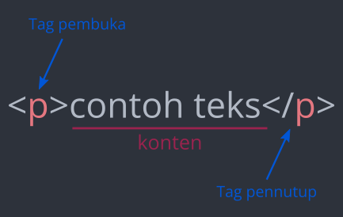

# Fundamental

## Element dan Tag

- Pendahuluan
- Outcome pembelajaran
- Tugas
- Resource tambahan
- Pengecekan pembelajaran

### Pendahuluan

---

HTML (HyperText Markup Language) mendefinisikan struktur dan isi dari sebuah laman web. Kita menggunakan element HTML untuk membuat halaman web umumnya yang terdiri dari paragraf, judul bab (heading), daftar bullet point, gambar, dan link. Kali ini kita akan mengeksplorasi bagaimana element HTML bekerja.

### Outcome pembelajaran

---

Selesai sesi ini, kamu diharapkan mengerti:

- Menjelaskan apa saja Tag HTML
- Menjelaskan apa saja Element HTML

### Element dan Tag {#elements-and-tags}

---

Hampir semua elemen pada halaman HTML hanyalah potongan konten yang dibungkus dengan tag HTML pembuka dan penutup.

Tag pembuka memberi tahu browser bahwa ini adalah awal dari elemen HTML. Mereka terdiri dari kata kunci yang diapit tanda kurung sudut `<>`. Misalnya, tag paragraf pembuka terlihat seperti ini: `
`.

Tag penutup memberi tahu browser di mana suatu elemen berakhir. Mereka hampir sama dengan tag pembuka; satu-satunya perbedaan adalah mereka memiliki garis miring sebelum kata kunci. Misalnya, tag paragraf penutup terlihat seperti ini: `
`.

Elemen HTML paragraf penuh terlihat seperti ini:

Kamu dapat menganggap elemen sebagai wadah untuk konten. Tag pembuka dan penutup memberi tahu browser konten apa yang dikandung elemen tersebut. Browser kemudian dapat menggunakan informasi tersebut untuk menentukan bagaimana seharusnya menafsirkan dan memformat konten.

Ada beberapa elemen HTML yang tidak memiliki tag penutup. Ini dikenal sebagai elemen kosong karena tidak membungkus konten apa pun. Kita akan menemukan beberapa di antaranya dalam pelajaran selanjutnya, tetapi sebagian besar, elemen akan memiliki tag pembuka dan penutup.

HTML memiliki [daftar tag standar](https://developer.mozilla.org/en-US/docs/Web/HTML/Element) yang dapat kamu gunakan untuk membuat semua jenis elemen yang berbeda. Penting untuk menggunakan tag yang benar untuk konten. Menggunakan tag yang benar dapat berdampak besar pada dua aspek situs kamu: bagaimana peringkatnya di mesin telusur/pencari; dan seberapa mudah aksesnya bagi pengguna yang mengandalkan teknologi bantu, seperti pembaca layar, untuk menggunakan internet.

Menggunakan elemen yang benar untuk konten disebut semantik HTML. Kami akan mengeksplorasi ini secara lebih mendalam nanti dalam kurikulum.

### Tugas

---

> [Tonton Video Pengantar Kevin Powell tentang HTML](https://www.youtube.com/watch?v=LGQuIIv2RVA&list=PL4-IK0AVhVjM0xE0K2uZRvsM7LkIhsPT-)

### Resource tambahan

---

Bagian ini berisi tautan bermanfaat ke konten lain sebagai tambhanan.

> [Jangan Takut video Internet tentang HTML](http://www.dontfeartheinternet.com/02-html)

### Pengecekan pembelajaran

---

Bagian ini berisi pertanyaan untuk memeriksa pemahaman kamu tentang pelajaran ini. Jika kamu kesulitan menjawab pertanyaan di bawah, tinjau materi di atas untuk menemukan jawabannya.

- [Apa itu tag HTML?](#elements-and-tags)

- [Apa saja tiga bagian dari elemen HTML?](./img/element-diagram.png)
